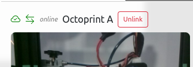

#  ZupFe For OctoPrint

**ZupFe For Octoprint**, the interactive online G-code viewer.

See [ZupFe](https://zupfe.velor.ca)

## Setup

Install via the bundled [Plugin Manager](https://docs.octoprint.org/en/master/bundledplugins/pluginmanager.html)
or manually by downloading this archive:

[Zupfe For Octoprint on GitHub](https://github.com/glennerichall/OctoPrint-Zupfe/archive/master.zip)

### To have a direct connection to your printer

ZupFe uses WebRTC to establish a direct connection to OctoPrint instance. For some reason, aiortc package
in OctoPi is missing `libsrtp2`. An error message can be seen in logs (you must enable
debug logs for *octoprint.plugins.zupfe*) with the following:

*Loading aiortc failed with error: libsrtp2.so.1: cannot open shared object file: No such file or directory*

Consequently, you won't see the direct link icon in *Preferences*

- Ssh to your octopi instance
- Run the following command to install missing library:

    sudo apt install libsrtp2-1

You should now see the direct link in *Preference*, and all communications with your OctoPrint instance will be
direct without transiting through ZupFe servers (if available, normally on same LAN).

