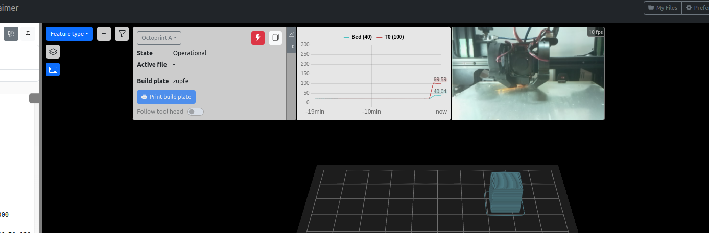

#  ZupFe For OctoPrint

**ZupFe For Octoprint**, the interactive online G-code viewer.

See [ZupFe](https://zupfe.velor.ca)

## Setup

Install via the bundled [Plugin Manager](https://plugins.octoprint.org/plugins/zupfe/)
or manually by downloading this archive:

[Zupfe For Octoprint on GitHub](https://github.com/glennerichall/OctoPrint-Zupfe/archive/master.zip)
